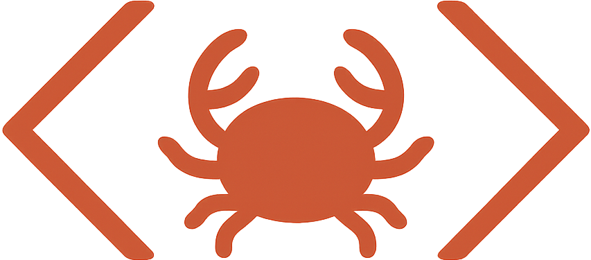

#   BasicRS

BasicRS is a Rust implementation of a BASIC Interpreter.

BasicRS is part of the TrekBasic family of BASIC programming tools.
* [TrekBasic](https://github.com/cocode/TrekBASIC) - Basic compiler and interpreter in Python
* [TrekBasicJ](https://github.com/cocode/TrekBasicJ) - Basic compiler and interpreter in Java
* [BasicRS](https://github.com/cocode/BasicRS) - Basic compiler written in Rust
* [BasicTestSuite](https://github.com/cocode/BasicTestSuite) - A test suite of BASIC Programs
* [TrekBot](https://github.com/cocode/TrekBot) - A tool to exercise the superstartrek program

All versions, interpreted and compiled, are intended to by byte-by-byte compatible, but are not
there yet - but they are close. TrekBot and BasicTestSuite are part of the
plan to ensure full compatibility.

My goal was to be able to play the old Star Trek game, which was written in BASIC.

    https://en.wikipedia.org/wiki/Star_Trek_(1971_video_game). 

I have achieved that goal.

## To Run

cargo run -- superstartrek.bas

OR

target/debug/basic_rs superstartrek.bas

## Shell
If you want to use the shell for BASIC which is the command line "IDE" - sort of.

It provides breakpoints, single stepping, code coverage, and more.  

./target/debug/basic_shell superstartrek.bas

or just

./target/debug/basic_shell
